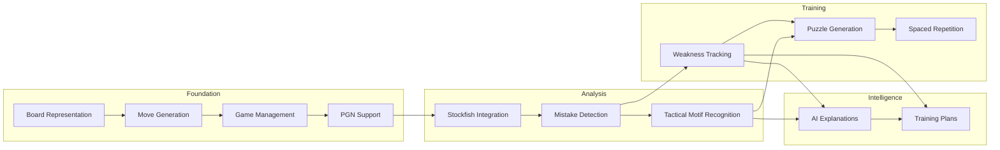
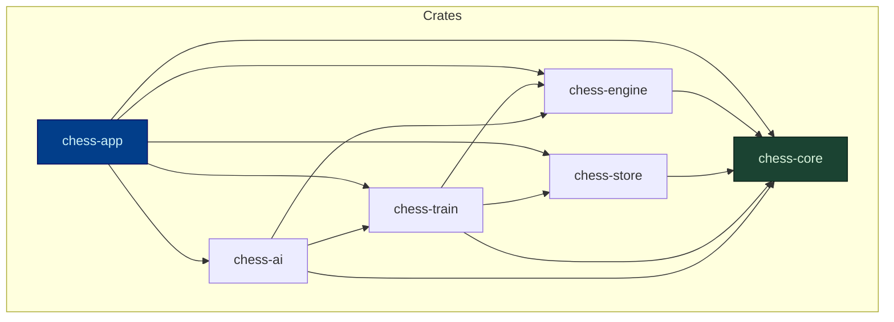
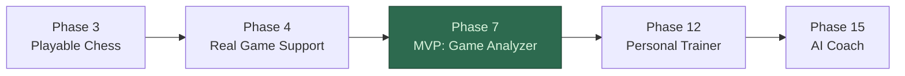

# ChessWise

A desktop chess training application built in Rust. ChessWise is not another chess engine. It is a personal chess coach that uses Stockfish for analysis and focuses on helping players improve their thinking process, with a specialization in middlegame play.

---

## Vision

Most chess tools show you what the best move is. ChessWise tells you why your move was wrong, what you missed, and trains you on the exact situations where you keep failing.

The application is designed around a single idea: a chess player improves fastest when they study their own mistakes in context, understand the patterns behind those mistakes, and practice those specific patterns until they become second nature.

ChessWise does this by analyzing your games, detecting recurring weaknesses across your entire game history, generating puzzles from your own blunders, and resurfacing those puzzles through spaced repetition until the patterns stick.

The long-term goal is an AI-powered coach that can explain positions and plans in plain English, grounded in real engine analysis rather than generic advice.

---

## Why This Exists

There is no shortage of chess software. What is missing is software that bridges the gap between raw engine output and genuine understanding. A centipawn evaluation of +1.8 means nothing to a 1200-rated player. Being told "you missed a knight fork that wins the exchange and exposes the king to a mating attack" means everything.

ChessWise exists to close that gap.

---

## Design Philosophy

**Coach, not engine.** The engine is a tool, not the product. ChessWise uses Stockfish the way a human coach uses a board -- to verify ideas and find truth. The value comes from interpretation, explanation, and targeted training.

**Your games, your weaknesses.** Generic puzzle sets train generic skills. ChessWise generates training material from your actual games, targeting the specific tactical and positional patterns you personally struggle with.

**Thinking process over memorization.** The goal is not to memorize opening lines or endgame tablebase positions. The goal is to develop the ability to evaluate a position, identify candidate moves, calculate variations, and choose the right plan. Every feature serves this goal.

**Incremental complexity.** The application starts as a simple chess library and grows into a full training system. Each development phase produces a working application. Nothing is built on an unstable foundation.

---

## Core Capabilities

ChessWise is being built in phases. The following diagram shows the major capability areas and how they build on each other.

### Foundation Layer

- Full chess board representation with FEN support
- Legal move generation with complete rule enforcement
- Game state management with undo, redo, and draw detection
- PGN import and export with annotation and variation support

### Analysis Layer

- Stockfish integration through the UCI protocol
- Per-move evaluation with centipawn loss calculation
- Move classification into best, good, inaccuracy, mistake, and blunder
- Candidate move comparison showing what you played versus what you should have played
- Threat detection revealing what your opponent's ideas were
- Tactical motif recognition identifying forks, pins, skewers, discovered attacks, and hanging pieces

### Training Layer

- Puzzle extraction from your own analyzed games
- Middlegame-focused training filtering positions to the post-opening phase
- Spaced repetition scheduling that resurfaces failed puzzles at increasing intervals
- Weakness profiling across your full game history
- Performance statistics with accuracy trends and game-phase breakdowns

### Intelligence Layer (Future)

- AI-powered natural language explanations of engine evaluations
- Conversational coach that answers questions about specific positions
- Personalized training plans generated from your weakness profile
- Context-aware analysis combining engine output, motif detection, and game history

---

## Architecture Overview

ChessWise is structured as a Cargo workspace with distinct crates for each major concern. The architecture enforces separation between chess logic, engine integration, storage, UI, and AI through trait-based abstractions.

| Crate | Responsibility |
|---|---|
| **chess-core** | Board, moves, game state, FEN, PGN. Zero external dependencies beyond std. |
| **chess-engine** | UCI protocol, Stockfish process management, analysis pipeline. |
| **chess-store** | SQLite persistence for games, analysis results, training state. |
| **chess-train** | Puzzle generation, spaced repetition, weakness profiling, statistics. |
| **chess-ai** | LLM integration, natural language explanations, training plan generation. |
| **chess-app** | User interface, application state, event handling. |

The key design constraint is that **chess-core has no upward dependencies**. It knows nothing about engines, databases, or AI. Every other crate depends on chess-core, but chess-core depends on nothing. This makes the core logic independently testable and reusable.

Engine and storage capabilities are accessed through traits defined in chess-core, with implementations provided by their respective crates. This allows the application to swap Stockfish for a different engine, or SQLite for a different database, without changing any analysis or training logic.

---

## Development Roadmap

The project is built in 15 phases. Each phase produces a working application and introduces progressively more advanced Rust concepts.

```mermaid
gantt
    title ChessWise Development Phases
    dateFormat X
    axisFormat %s

    section Foundation
    Board and FEN             :done, p1, 0, 1
    Move Generation           :done, p2, 1, 2
    Game State and History    :done, p3, 2, 3
    PGN Import and Export     :done, p4, 3, 4
    Architecture Refactor     :done, p5, 4, 5

    section Analysis
    Stockfish Integration     :active, p6, 5, 6
    Mistake Detection (MVP)   :p7, 6, 7

    section Experience
    Terminal UI               :p8, 7, 8
    Tactical Motifs           :p9, 7, 8
    Database and Storage      :p10, 7, 8

    section Training
    Weakness Tracking         :p11, 8, 9
    Puzzles and Training      :p12, 9, 10
    Eval Graphs and Reports   :p13, 8, 9

    section Intelligence
    Opening and Endgame       :p14, 8, 9
    AI Coach                  :p15, 10, 11
```

### Milestones

**Phase 3** delivers a playable chess game in the terminal with full undo and redo.

**Phase 4** connects the application to real chess games through PGN import and export.

**Phase 7** is the Minimum Viable Product. At this point, ChessWise can analyze your games, classify every move, detect blunders, compare your moves against engine recommendations, and produce a structured analysis report. This is where the application stops being a chess library and starts being a coach.

**Phase 12** adds personalized training with puzzles generated from your own mistakes, spaced repetition, and weakness tracking across your game history.

**Phase 15** is the capstone. An AI layer that explains positions in plain English, answers questions about your games, and generates training plans tailored to your weakness profile.

---

## Middlegame Focus

ChessWise pays special attention to the middlegame, the phase of the game that begins roughly after move 8 to 10 when the opening is over and concrete calculation, planning, and pattern recognition become critical.

Many players, especially in the intermediate range, have a reasonable opening repertoire and understand basic endgames but consistently struggle in the middlegame. They do not know how to formulate a plan, which pieces to trade, where to place their pieces, or how to exploit structural weaknesses.

ChessWise addresses this by:

- Filtering analysis and training to focus on middlegame positions
- Detecting middlegame-specific tactical motifs
- Tracking middlegame accuracy separately from opening and endgame accuracy
- Generating puzzles specifically from middlegame mistakes
- Identifying recurring middlegame patterns that cause the most centipawn loss

The opening explorer and endgame trainer exist for completeness, but the middlegame is where ChessWise earns its name.

---

## Technology

| Component | Technology |
|---|---|
| Language | Rust |
| Analysis Engine | Stockfish (via UCI protocol) |
| Storage | SQLite |
| Terminal UI | ratatui |
| Configuration | TOML via serde |
| Logging | tracing |
| AI Integration | LLM API (provider-agnostic) |

Rust was chosen for performance, safety, and as a learning vehicle. The project is designed to introduce Rust concepts progressively, from basic enums and pattern matching in the early phases to async programming and trait-based abstraction in later phases.

Stockfish is integrated as an external process, not compiled into the binary. ChessWise communicates with Stockfish through the Universal Chess Interface protocol, which means any UCI-compatible engine can be substituted.

---

## Project Status

ChessWise is in active development. The current focus is on building the foundation layer: board representation, move generation, game state management, and PGN support.

Contributions, feedback, and ideas are welcome. See the roadmap above for what is currently being worked on and what comes next.

---

## License

This project is open source. See the [LICENSE](LICENSE) file for details.
